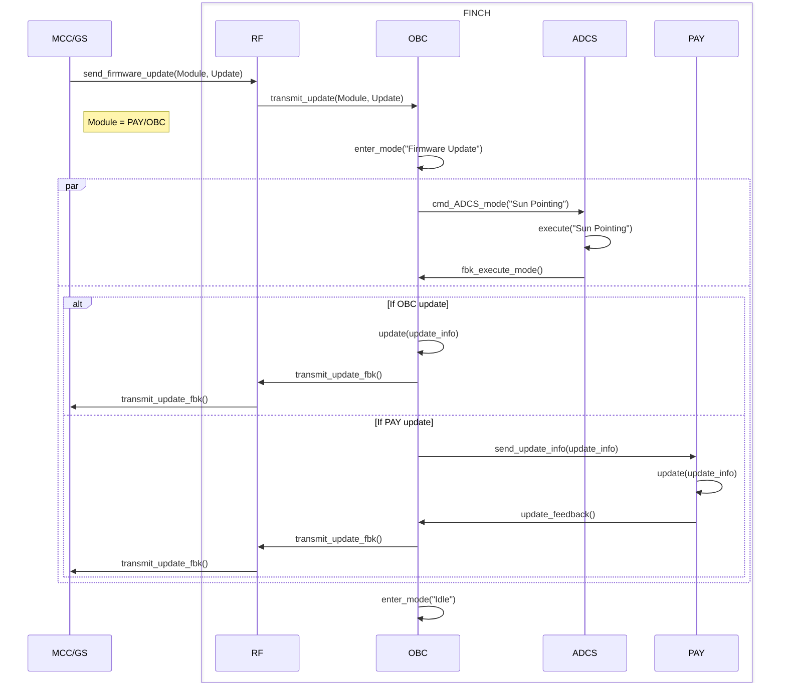

# Firmware Update Command Sequence 

```mermaid
sequenceDiagram
    participant MCC/GS
    box FINCH
        participant RF
        participant OBC
        participant ADCS
        participant PAY
    end

    MCC/GS->>RF: send_firmware_update(Module, Update)
    RF->>OBC: transmit_update(Module, Update)
    Note right of MCC/GS: Module = PAY/OBC

    OBC->>OBC: enter_mode("Firmware Update")

    par
        OBC->>ADCS: cmd_ADCS_mode("Sun Pointing")
        ADCS->>ADCS: execute("Sun Pointing")
        ADCS->>OBC: fbk_execute_mode()
    and
        alt If OBC update
            OBC->>OBC: update(update_info)
            OBC->>RF: transmit_update_fbk()
            RF->>MCC/GS: transmit_update_fbk()
        else If PAY update
            OBC->>PAY: send_update_info(update_info)
            PAY->>PAY: update(update_info)
            PAY->>OBC: update_feedback()
            OBC->>RF: transmit_update_fbk()
            RF->>MCC/GS: transmit_update_fbk()
        
        end
    end
    OBC->>OBC: enter_mode("Idle")
```
