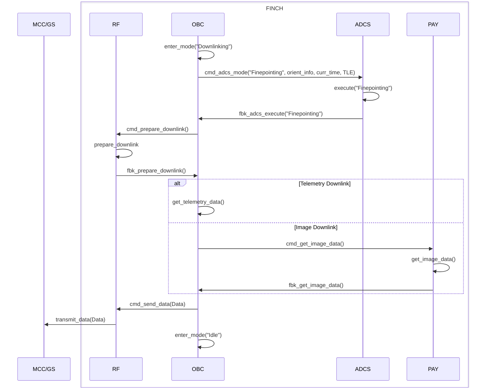

# Downlinking Command Sequence

```mermaid

sequenceDiagram

    participant MCC/GS
    box FINCH
        participant RF
        participant OBC
        participant ADCS
        participant PAY
    end

    OBC ->> OBC: enter_mode("Downlinking")

    OBC ->> ADCS: cmd_adcs_mode("Finepointing", orient_info, curr_time, TLE)
    ADCS ->> ADCS: execute("Finepointing")
    ADCS ->> OBC: fbk_adcs_execute("Finepointing")

    OBC ->> RF: cmd_prepare_downlink()
    RF ->> RF: prepare_downlink
    RF ->> OBC: fbk_prepare_downlink()

    alt Telemetry Downlink
        OBC ->> OBC: get_telemetry_data()
    else Image Downlink

        OBC ->> PAY: cmd_get_image_data()
        PAY ->> PAY: get_image_data()
        PAY ->> OBC: fbk_get_image_data()
    end

    OBC ->> RF: cmd_send_data(Data)
    RF ->> MCC/GS: transmit_data(Data)

    OBC ->> OBC: enter_mode("Idle")
```
