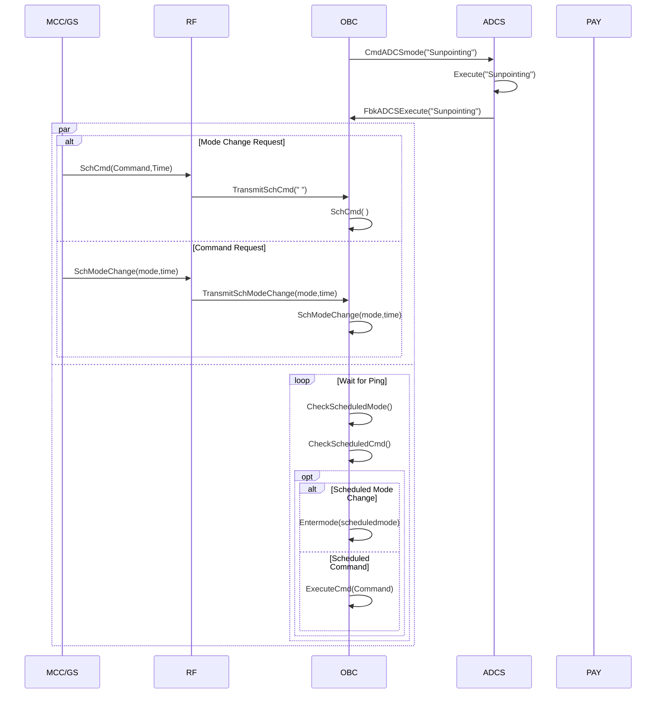

# Idle Command Sequence

```mermaid
sequenceDiagram
    participant MCC/GS
        participant RF
        participant OBC 
        participant ADCS
        participant PAY


    OBC ->> ADCS: CmdADCSmode("Sunpointing")
    ADCS ->> ADCS: Execute("Sunpointing")
    ADCS ->> OBC: FbkADCSExecute("Sunpointing")

    par 
        alt Mode Change Request
            MCC/GS ->> RF: SchCmd(Command,Time)
            RF ->> OBC: TransmitSchCmd("    ")
            OBC ->> OBC: SchCmd(    )
         else Command Request
            MCC/GS ->> RF: SchModeChange(mode,time)
            RF ->> OBC: TransmitSchModeChange(mode,time)
            OBC ->> OBC: SchModeChange(mode,time)
        end
    and

        loop Wait for Ping
            OBC ->> OBC: CheckScheduledMode()
            OBC ->> OBC: CheckScheduledCmd() 
            opt
                alt Scheduled Mode Change
                     OBC ->> OBC: Entermode(scheduledmode)
                else Scheduled Command
                    OBC ->> OBC: ExecuteCmd(Command)
                end
            end
        end
    end
 
```
