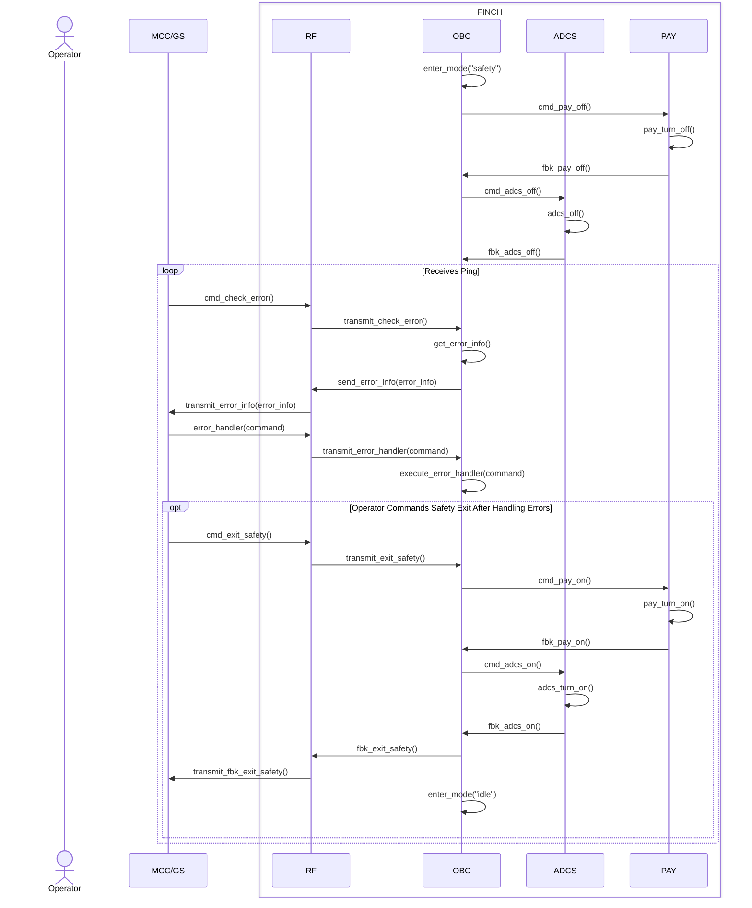

# Safety Command Sequence 

```mermaid
sequenceDiagram
    actor Operator
    participant MCC/GS
    box FINCH
        participant RF
        participant OBC
        participant ADCS
        participant PAY
    end

    %% Enter Safety Mode
    OBC ->> OBC: enter_mode("safety")

    OBC ->> PAY: cmd_pay_off()
    PAY ->> PAY: pay_turn_off()
    PAY ->> OBC: fbk_pay_off()

    OBC ->> ADCS: cmd_adcs_off()
    ADCS ->> ADCS: adcs_off()
    ADCS ->> OBC: fbk_adcs_off()

    %% Error Monitoring Loop (includes MCC/GS)
    loop Receives Ping
        MCC/GS ->> RF: cmd_check_error()
        RF ->> OBC: transmit_check_error()
        OBC ->> OBC: get_error_info()
        OBC ->> RF: send_error_info(error_info)
        RF ->> MCC/GS: transmit_error_info(error_info)

        MCC/GS ->> RF: error_handler(command)
        RF ->> OBC: transmit_error_handler(command)
        OBC ->> OBC: execute_error_handler(command)

        %% Optional exit inside the loop
        opt Operator Commands Safety Exit After Handling Errors
            MCC/GS ->> RF: cmd_exit_safety()
            RF ->> OBC: transmit_exit_safety()

            OBC ->> PAY: cmd_pay_on()
            PAY ->> PAY: pay_turn_on()
            PAY ->> OBC: fbk_pay_on()

            OBC ->> ADCS: cmd_adcs_on()
            ADCS ->> ADCS: adcs_turn_on()
            ADCS ->> OBC: fbk_adcs_on()

            OBC ->> RF: fbk_exit_safety()
            RF ->> MCC/GS: transmit_fbk_exit_safety()

            OBC ->> OBC: enter_mode("idle")
        end
    end
```
